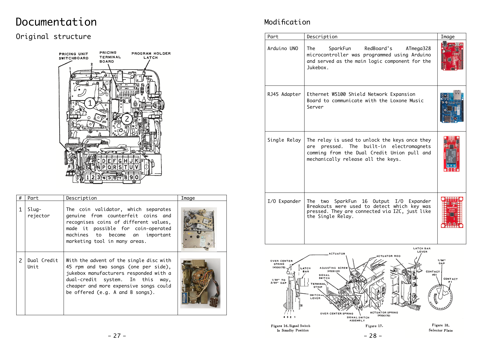
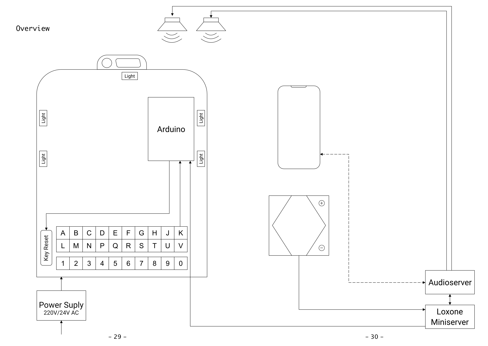
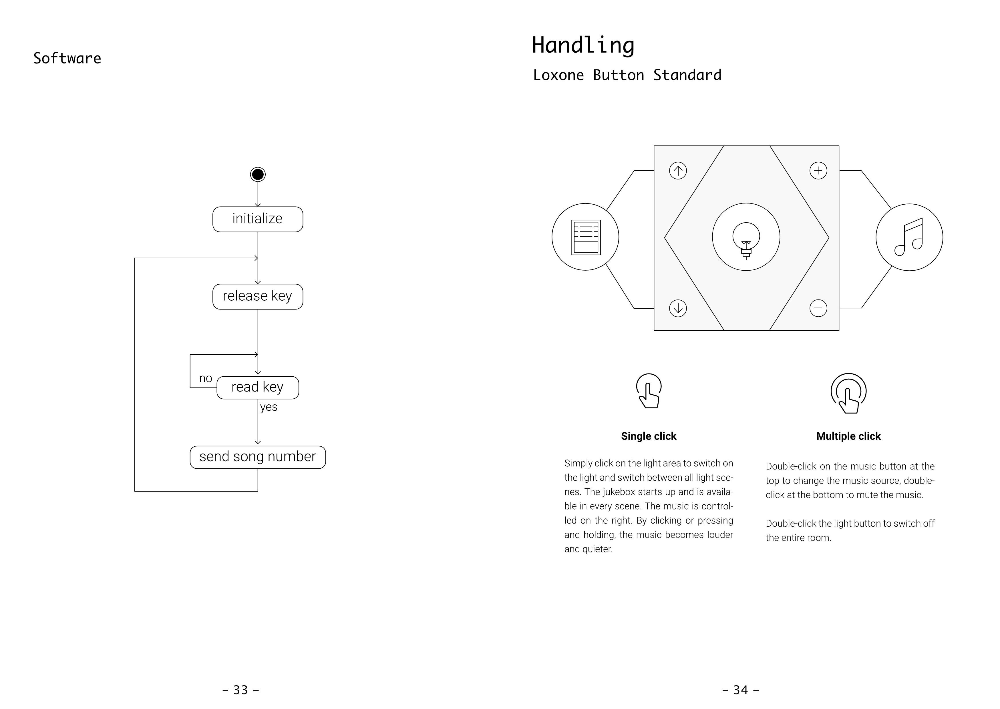
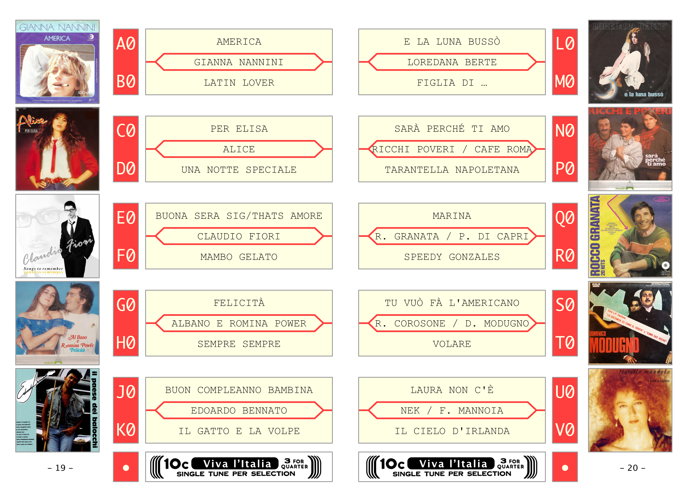

# Bringing Life into Vintage Devices: Integrating a Jukebox into a Smart Home

<b>Refurbished Seeburger Wall-o-Matic 200</b>

This jukebox has the capability to play 200 different songs, selectable via a key interface. In our refurbishment, the keys now serve as digital inputs to an Arduino. We repurposed the original electromagnets from the Dual Credit Unit to reset the keys. The illumination has been upgraded to LED. Once a song is selected, it is sent to the Loxone Audio Server for playback. The software is programmed in C++.

---
<b>Documentation from the booklet</b>  
Download the full booklet which is saved in the folder <code>booklet/booklet.pdf</code>.

